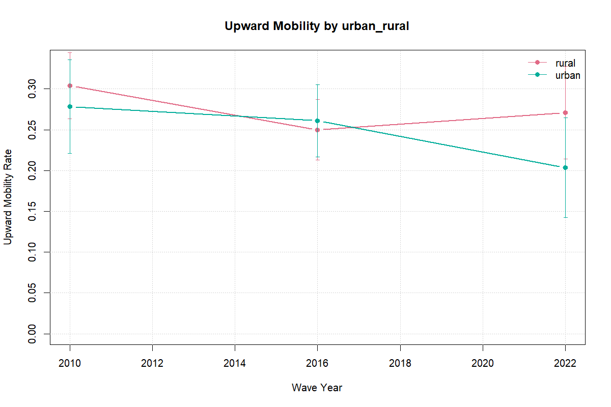

```{r}
source(file.path("..", "R", "91_manuscript_helpers.R"))
load_main_manuscript_context("..")

fmt_int <- function(x) {
  x <- as.numeric(x)
  ifelse(is.na(x), "\u2014", format(as.integer(round(x)), big.mark = ",", trim = TRUE, scientific = FALSE))
}

wave_levels <- c(2010, 2016, 2022)
wave_labels <- c(`2010` = "2010", `2016` = "2016", `2022` = "2022-23")
cohort_levels <- c("25-34", "35-44", "45-54", "55-64")

sample_by_wave <- read_csv_safe(project_file("outputs", "tables", "tier_a_sample_by_wave.csv"))
data_completeness <- read_csv_safe(project_file("outputs", "tables", "tier_a_data_completeness.csv"))
transition_summary <- read_csv_safe(project_file("outputs", "tables", "tier_a_transition_summary.csv"))
region_trends <- read_csv_safe(project_file("outputs", "tables", "tier_a_region_trends.csv"))
subgroup_trends <- read_csv_safe(project_file("outputs", "tables", "tier_a_subgroup_trends.csv"))
subgroup_metrics <- read_csv_safe(project_file("outputs", "tables", "module_a_subgroup_metrics.csv"))
module_b_key_compare <- read_csv_safe(project_file("outputs", "tables", "module_b_key_coefficient_comparison.csv"))
module_b_wave_profiles <- read_csv_safe(project_file("outputs", "tables", "module_b_persistence_wave_profiles.csv"))
module_b_wave_tests <- read_csv_safe(project_file("outputs", "tables", "module_b_wave_difference_tests.csv"))
module_b_covariate_class <- read_csv_safe(project_file("outputs", "tables", "module_b_covariate_classification.csv"))
module_b_selected_covariates <- read_csv_safe(project_file("outputs", "tables", "module_b_selected_covariates.csv"))
lits_harmonized <- read_csv_safe(project_file("data", "processed", "lits_harmonized.csv"))
parent_missingness <- read_csv_safe(project_file("outputs", "tables", "empirical_parent_missingness_by_wave.csv"))
parent_missingness_observables <- read_csv_safe(project_file("outputs", "tables", "empirical_parent_missingness_observables.csv"))
parent_missingness_sensitivity <- read_csv_safe(project_file("outputs", "tables", "empirical_parent_missingness_sensitivity.csv"))
parent_harmonization_robustness <- read_csv_safe(project_file("outputs", "tables", "empirical_parent_harmonization_robustness.csv"))
rank_change_tests <- read_csv_safe(project_file("outputs", "tables", "empirical_rank_rank_change_tests.csv"))
common_region_rank <- read_csv_safe(project_file("outputs", "tables", "empirical_common_region_rank_rank.csv"))
subgroup_trend_checks <- read_csv_safe(project_file("outputs", "tables", "empirical_subgroup_trend_checks.csv"))
trend_comparison <- read_csv_safe(project_file("outputs", "tables", "empirical_trend_comparison.csv"))
hbs_support_context <- read_csv_safe(project_file("outputs", "tables", "hbs_household_support_context.csv"))
hbs_linkage_diagnostics <- read_csv_safe(project_file("data", "processed", "hbs_linkage_diagnostics.csv"))
module_c_robust_scenarios <- read_csv_safe(project_file("outputs", "tables", "module_c_mechanism_robustness_scenarios.csv"))
module_c_robust_coef <- read_csv_safe(project_file("outputs", "tables", "module_c_mechanism_robustness_coefficients.csv"))

lits_harmonized$age_num <- suppressWarnings(as.numeric(lits_harmonized$age))
lits_harmonized$wave_year <- suppressWarnings(as.integer(lits_harmonized$wave_year))
lits_harmonized$urban_num <- suppressWarnings(as.numeric(lits_harmonized$urban))
lits_uzb_sample <- lits_harmonized[
    !is.na(lits_harmonized$age_num) &
    lits_harmonized$age_num >= 25 &
    lits_harmonized$age_num <= 64,
]

hbs_context_value <- function(metric, column = "national") {
  as.numeric(hbs_support_context[hbs_support_context$metric == metric, column][1])
}

robust_scenario_value <- function(scenario_id, column) {
  rows <- module_c_robust_scenarios[module_c_robust_scenarios$scenario_id == scenario_id, ]
  if (nrow(rows) == 0 || !(column %in% names(rows))) {
    return(NA)
  }
  rows[[column]][1]
}

rank_change_value <- function(comparison, column) {
  rows <- rank_change_tests[rank_change_tests$comparison == comparison, ]
  if (nrow(rows) == 0 || !(column %in% names(rows))) {
    return(NA)
  }
  rows[[column]][1]
}

module_b_profile_value <- function(specification, wave_year, column = "estimate") {
  rows <- module_b_wave_profiles[
    module_b_wave_profiles$specification == specification &
      module_b_wave_profiles$wave_year == wave_year,
  ]
  if (nrow(rows) == 0 || !(column %in% names(rows))) {
    return(NA)
  }
  rows[[column]][1]
}

module_b_wave_test_value <- function(specification, comparison, column = "estimate") {
  rows <- module_b_wave_tests[
    module_b_wave_tests$specification == specification &
      module_b_wave_tests$comparison == comparison,
  ]
  if (nrow(rows) == 0 || !(column %in% names(rows))) {
    return(NA)
  }
  rows[[column]][1]
}

common_region_value <- function(sample_support, wave_year, column = "estimate") {
  needed_cols <- c("sample_support", "wave_year")
  if (!all(needed_cols %in% names(common_region_rank))) {
    return(NA)
  }
  rows <- common_region_rank[
    common_region_rank$sample_support == sample_support &
      common_region_rank$wave_year == wave_year,
  ]
  if (nrow(rows) == 0 || !(column %in% names(rows))) {
    return(NA)
  }
  rows[[column]][1]
}

missingness_value <- function(wave_year, column = "parent_missing_share") {
  rows <- parent_missingness[parent_missingness$wave_year == wave_year, ]
  if (nrow(rows) == 0 || !(column %in% names(rows))) {
    return(NA)
  }
  rows[[column]][1]
}

missingness_stat_value <- function(wave_year, statistic, column = "difference_missing_minus_observed") {
  rows <- parent_missingness_observables[
    parent_missingness_observables$wave_year == wave_year &
      parent_missingness_observables$statistic == statistic,
  ]
  if (nrow(rows) == 0 || !(column %in% names(rows))) {
    return(NA)
  }
  rows[[column]][1]
}

sensitivity_value <- function(scenario_id, wave_year, metric, column = "estimate") {
  rows <- parent_missingness_sensitivity[
    parent_missingness_sensitivity$scenario_id == scenario_id &
      parent_missingness_sensitivity$wave_year == wave_year &
      parent_missingness_sensitivity$metric == metric,
  ]
  if (nrow(rows) == 0 || !(column %in% names(rows))) {
    return(NA)
  }
  rows[[column]][1]
}

parent_harmonization_value <- function(variant, wave_year, column = "estimate") {
  rows <- parent_harmonization_robustness[
    parent_harmonization_robustness$harmonization_variant == variant &
      parent_harmonization_robustness$wave_year == wave_year,
  ]
  if (nrow(rows) == 0 || !(column %in% names(rows))) {
    return(NA)
  }
  rows[[column]][1]
}
```

## Abstract {.unnumbered}

Uzbekistan has nearly doubled the number of higher education institutions since 2017, yet no multi-wave evidence exists on whether family background is losing its grip on educational attainment. This paper uses the Life in Transition Survey for 2010, 2016, and 2022-23 to provide the first three-wave profile of intergenerational educational mobility in the country. The rank-rank persistence slope rises from `r fmt_num(metric_est("rank_rank_slope", 2010))` in 2010 to `r fmt_num(metric_est("rank_rank_slope", 2016))` in 2016 (p = `r fmt_p(rank_change_value("2010_to_2016", "p.value"))`) and stands at `r fmt_num(metric_est("rank_rank_slope", 2022))` in 2022-23. Parental education is the strongest and most stable predictor of attainment across nested pooled specifications; in 2022-23, `r fmt_pct(transition_summary$share[transition_summary$wave_year == 2022 & transition_summary$parent_ed_level == "tertiary" & transition_summary$own_ed_level == "tertiary"])` of respondents from university-educated families also reached university. A child-module extension documents widespread pandemic-era learning disruption and heavy reliance on maternal support, but no clear gap in education stoppage by parental education. Expanding formal access has not yet weakened the link between family background and schooling outcomes.

**Keywords:** intergenerational mobility, educational attainment, Uzbekistan, Life in Transition Survey, rank-rank slope

**JEL codes:** I24, I26, J62, P36

## Introduction

Between 2017 and 2024, Uzbekistan nearly doubled the number of higher education institutions (from 119 to 222) and tripled enrolled students from roughly 441,000 to over 1.4 million [@uzb_admin_he_2025]. This expansion, layered onto three decades of post-Soviet market transition, raises a question that the country's own evidence base cannot yet answer: has broader access weakened the link between parental education and children's attainment, or does family background retain its grip even as formal opportunity expands?

This paper uses the Life in Transition Survey (LiTS) for 2010, 2016, and 2022-23 to provide the first multi-wave profile of intergenerational educational mobility in Uzbekistan. The rank-rank persistence slope — the within-wave gradient between respondent and parental education rank — rises from `r fmt_num(metric_est("rank_rank_slope", 2010))` in 2010 to `r fmt_num(metric_est("rank_rank_slope", 2016))` in 2016, a statistically significant increase (p = `r fmt_p(rank_change_value("2010_to_2016", "p.value"))`). The 2022-23 slope is `r fmt_num(metric_est("rank_rank_slope", 2022))`. These values place Uzbekistan in the moderate-to-high range for developing countries; Hertz et al. [-@hertz_2008] report intergenerational education correlations spanning 0.20 to 0.60 across settings. Parental education is the strongest and most stable predictor across all pooled specifications, and the nested model structure shows that adding demographic and household controls does not weaken that association. To put the 2016 slope in concrete terms: at `r fmt_num(metric_est("rank_rank_slope", 2016))`, a child whose parents sit at the 25th percentile of the educational distribution is predicted to reach the `r fmt_num(100 * (0.5 - 0.25 * metric_est("rank_rank_slope", 2016)), digits = 0)`th percentile of own education, compared to the `r fmt_num(100 * (0.5 + 0.25 * metric_est("rank_rank_slope", 2016)), digits = 0)`th percentile for a child at the 75th parental percentile. The implied gap is roughly `r fmt_num(100 * 0.5 * metric_est("rank_rank_slope", 2016), digits = 0)` percentile points. A child-module extension from the 2022-23 wave documents widespread pandemic-era learning disruption and heavy reliance on maternal support, but finds no robust parental-education gap in education stoppage.

The paper uses a pre-specified ("locked") bundle of measures: a rank-rank slope, upward mobility, downward mobility, and same-category persistence, held constant across all waves and specifications. Category-based rates preserve substantive interpretability; rank-based measures are better suited to cross-wave comparison because they locate respondents within each wave's distribution and are less sensitive to aggregate educational expansion [@torche_2015; @weide_etal_2024; @stromberg_engzell_2025]. This dual approach matters because no single statistic fully describes opportunity, and recent evidence shows that cross-country mobility rankings shift with coding choices and sample definitions [@torche_2015].

Comparative evidence on intergenerational educational mobility is extensive, but it leaves a clear gap for Uzbekistan. Cross-country studies document three regularities: mobility varies widely and does not converge mechanically with development; many developing settings display lower mobility than richer economies even after expansion; and rising access does not automatically weaken family-background gradients at upper schooling levels [@hertz_2008; @narayan_etal_2018; @weide_etal_2024; @emran_shilpi_2015]. Post-socialist economies show no single mobility path; common Soviet legacies do not determine later outcomes [@verashchagina_2012]. Kyrgyzstan is the closest Central Asian comparator in the published literature [@bruck_esenaliev_2018], and Turkey provides a useful benchmark because it combines middle-income status with strong spatial disparities in school availability [@aydemir_yazici_2019]. Both cases show that mobility is higher where schooling opportunity and household resources are stronger, which motivates this paper's attention to regional, cohort, and place-based heterogeneity.

For Uzbekistan specifically, the evidence base remains weighted toward sector diagnostics and policy discussion. World Bank and UNICEF reports point to persistent disparities across region, location, gender, tertiary pathways, and household learning environments [@wb_uzb_2018; @unicef_sitan_2020; @unicef_sitan_2024; @wb_gender_2024], and analysis of the higher-education system identifies long-standing constraints in access, quality, governance, and labor-market relevance [@wb_modernizing_tertiary_2017]. These sources establish why parental education, regional conditions, and household support capacity are plausible correlates of mobility, but they are not mobility designs. Where bottlenecks remain strongest at advanced levels of schooling, intergenerational persistence can survive even as basic and secondary participation rise. Since 2017, a broad reform cycle (preschool expansion, sector restructuring, widened tertiary access) has reshaped the education system [@wb_uzb_2018; @unicef_compact_2024; @unicef_sitan_2024]. This paper does not attribute observed mobility patterns to reforms; it treats reform as context that sharpens interpretation.

The claims throughout are descriptive and associational. Module A documents levels and trends. Module B estimates conditional associations using pooled models with region, cohort, and wave fixed effects. Module C provides bounded non-causal evidence on pandemic-era household learning conditions. This belongs to the descriptive measurement strand of the mobility literature rather than to the causal identification strand that exploits exogenous variation across place, cohort, or policy exposure [@urbina_2018; @akarcay_polat_2017]. The relevant pandemic literature, on unequal burdens of school closures and household substitution for formal instruction, justifies asking whether lower-parent-education households report greater disruption, but the LiTS IV child module is a small cross-sectional subsample and does not support a causal account [@alam_tiwari_2020; @munoz_najar_etal_2021; @iqbal_patrinos_2025].

Section 2 describes the data and measurement choices, Section 3 lays out the empirical strategy, Sections 4 through 6 present the descriptive, associational, and pandemic-disruption results, and Section 7 discusses the findings and their implications.

## Data and Measurement

### Core Data

The main source is the Life in Transition Survey (LiTS) for 2010, 2016, and 2022-23. These are repeated cross-sections, not a panel: changes over time reflect shifts in population-level patterns rather than changes within fixed families. The surveys provide comparable information on respondents' own education, parental education, age, sex, and place of residence. Regional labels are harmonized with a fixed cross-wave mapping before pooled estimation; regional coverage still differs by wave, so regional results are interpreted as composition-conditional, not as fully balanced panel comparisons.

The analytical sample restricts to respondents aged 25-64 so that own education is largely complete. Cohorts are grouped as 25-34, 35-44, 45-54, and 55-64. The analysis uses weighted estimates throughout and suppresses subgroup outputs when the valid cell size falls below 30.

A second data source, the Household Budget Survey, provides supplementary context on household structure, migration, schooling expenses, tutoring, and internet access. Because direct parent-child linkage in HBS is only partially supported in the current audit, it is not the source of the intergenerational estimates reported here.

### Education Measures

The paper uses two measurement families built from a common harmonization step. LiTS parental-schooling responses vary across waves in wording and granularity, so all observed mother and father responses are first mapped onto a common six-category ladder: no formal education, primary, lower secondary, upper secondary, post-secondary non-tertiary, and tertiary. The implied years follow the project mapping in Appendix C1: 0, 6, 9, 11, 13, and 16 years. In Modules A and B, when both parents are observed, the analysis uses the higher reported category as the parental education measure; when only one parent is available, the observed value is retained. This max-parent rule keeps the intergenerational comparison consistent across waves while limiting attrition from asymmetric parental reporting, but it does not separate maternal and paternal channels or the contribution of assortative mating between parents.

Module C is narrower. It uses the mean of observed mother and father years for the low-versus-high split, because a weighted median split built on the max-parent proxy would set the threshold at `r fmt_num(robust_scenario_value("weighted_median_maxparent", "split_threshold"), digits = 1)` years and leave only `r fmt_int(robust_scenario_value("weighted_median_maxparent", "n_high_group"))` observations in the higher-parent group. Appendix D2 shows that the rank-based national series is stable under alternative parent constructions. A harmonization-specific check that replaces the back-converted 2010 max-parent years with observed parental years yields a 2010 slope of `r fmt_num(parent_harmonization_value("observed_max_parent_years", 2010))` instead of `r fmt_num(parent_harmonization_value("locked_category_max", 2010))`, while the 2016 and 2022-23 slopes are unchanged to three decimals. Category-based rates are more sensitive to whether the parent proxy uses the maximum, an average, or a single observed parent. The Module C split is a within-module partition, not a continuation of the max-parent gradient used in Modules A and B.

The harmonized ladder supports two complementary measures. An ordered education score enters category-based mobility rates and pooled attainment regressions. A within-wave weighted percentile rank enters the rank-rank persistence models. The category-based outcomes preserve the intuitive language of upward mobility, downward mobility, and same-category persistence. The rank-based outcomes are better suited to cross-wave comparison because they are less sensitive to questionnaire differences and to aggregate educational expansion. Reporting both is deliberate: one family preserves substantive interpretability, while the other provides the preferred cross-wave benchmark.

### Mobility Outcomes

Four outcomes are measured:

-   Rank-rank slope: the relationship between own education rank and parental education rank within each wave.
-   Upward mobility: an indicator that own education exceeds parental education.
-   Downward mobility: an indicator that own education is lower than parental education.
-   Persistence: an indicator that own education remains at the same category as parental education.

The paper reports these measures nationally and, where the denominator permits, by subgroup.

### Summary Statistics

Table @tbl-summary-stats reports the key variables by wave. Own and parental education years both rise across waves, reflecting both compositional shifts and expansion. The 2022-23 wave has a smaller sample and a higher female share in the unweighted data, though survey weights correct this for estimation.

```{r}
#| label: tbl-summary-stats
#| tbl-cap: "Summary statistics for the analytical sample by LiTS wave."
lits_all <- lits_harmonized
lits_all$age_num <- suppressWarnings(as.numeric(lits_all$age))
lits_all$wave_year <- suppressWarnings(as.integer(lits_all$wave_year))
lits_all$urban_num <- suppressWarnings(as.numeric(lits_all$urban))
lits_all$own_yrs <- suppressWarnings(as.numeric(lits_all$own_years_schooling))
lits_all$parent_yrs <- suppressWarnings(as.numeric(lits_all$parent_years_schooling))
lits_all$female <- as.numeric(lits_all$gender == "female")

summary_rows <- lapply(wave_levels, function(w) {
  wd <- lits_all[lits_all$wave_year == w & !is.na(lits_all$age_num) &
                    lits_all$age_num >= 25 & lits_all$age_num <= 64, ]
  data.frame(
    Wave = unname(wave_labels[as.character(w)]),
    N = nrow(wd),
    `Own education (years)` = sprintf("%.1f (%.1f)", mean(wd$own_yrs, na.rm=TRUE), sd(wd$own_yrs, na.rm=TRUE)),
    `Parental education (years)` = sprintf("%.1f (%.1f)", mean(wd$parent_yrs, na.rm=TRUE), sd(wd$parent_yrs, na.rm=TRUE)),
    `Age` = sprintf("%.1f (%.1f)", mean(wd$age_num, na.rm=TRUE), sd(wd$age_num, na.rm=TRUE)),
    `Female` = sprintf("%.1f%%", 100 * mean(wd$female, na.rm=TRUE)),
    `Urban` = sprintf("%.1f%%", 100 * mean(wd$urban_num, na.rm=TRUE)),
    check.names = FALSE, stringsAsFactors = FALSE
  )
})
summary_df <- do.call(rbind, summary_rows)
knitr::kable(summary_df)
```

Notes: Means with standard deviations in parentheses. Parental education uses the max-parent harmonized years. Female and urban shares are unweighted. The 2010 wave uses back-converted parental years from the continuous question (q718/q719); 2016 and 2022-23 use direct categorical responses mapped to the locked six-category ladder.

### Covariates

The pooled correlates models are estimated as a nested sequence. All specifications include region, cohort, and wave fixed effects. The minimal specification includes only the parental education term or interaction of interest. The demographic specification adds two clearly pre-determined controls, urban residence and female. The extended specification then adds current household variables that pass the project's coverage screen. A candidate extended control must be non-missing for at least 20 percent of the pooled sample, non-missing for at least 10 percent of observations in every wave, and take at least two distinct observed values. The extended controls that survive this gate are reported as sensitivity variables, not clean pre-treatment adjustments; the household income proxy is available only in the 2016 and 2022-23 waves and is excluded by the wave-specific coverage rule when all three waves enter the pooled sample.

For pooled inference, the implemented regressions cluster standard errors at the region level. The harmonized LiTS files retain a stable region identifier across waves, but no harmonized PSU variable is constructed in the pooled analysis files, so region clustering is the implemented fallback.

Because those pooled models rely on only 10 region clusters in 2010 and 2016 and 14 in 2022-23, Appendix D4 also reports Webb wild-cluster-bootstrap p-values alongside the conventional region-clustered p-values for the main persistence-trend comparisons. Throughout the paper, bootstrap `p <= 0.05` is described as statistically distinguishable, `0.05 < p <= 0.10` as suggestive, and `p > 0.10` as imprecise. No omnibus multiple-testing correction is applied across the full family of subgroup and appendix checks, so those results are used as structured corroboration, not standalone discovery claims.

### Pandemic Mechanism Variables

From the 2022-23 LiTS child module, the paper constructs descriptive indicators for remote-learning disruption, learning support, and home-learning constraints. These include switching to online learning, switching to hybrid learning, education stopping during COVID, school closure without online learning, shared-device use, support from mother, father, or relatives, and indicators for internet, device, cost, and time-balance challenges.

The mechanism sample is much smaller than the full LiTS IV sample. The child-module flow moves from `r sample_n("^Uzbekistan LiTS IV respondents$")` Uzbekistan respondents in LiTS IV to `r sample_n("^Respondents with child module eligibility info")` with child-module eligibility information, `r sample_n("^Respondents with child enrolled pre-COVID")` with a child enrolled before COVID, and `r sample_n("^Mechanism sample with non-missing parental schooling$")` with non-missing parental schooling. The extension illustrates patterns rather than supporting broad generalization.

## Empirical Strategy

The empirical strategy has three modules and uses one compact notation throughout. Let $Y_{iw}$ denote respondent $i$'s educational outcome in wave $w$, and let $P_{iw}$ denote parental education measured on the corresponding scale. In Module A, $Y_{iw}$ and $P_{iw}$ are within-wave education ranks. In Module B, $Y_i$ alternates across respondent rank, the harmonized education score, an indicator for upward mobility, and an indicator for same-category persistence; $P_i$ likewise denotes parental rank, the parental education score, or a set of parental education-category indicators. $U_i$ and $F_i$ indicate urban residence and female, $X_i$ collects migration exposure and multigenerational household structure, $D_{ti}$ is a wave indicator for $t \in \{2016, 2022\}$ with 2010 as the omitted category, and $\mu_r$, $\lambda_c$, and $\tau_w$ denote region, cohort, and wave effects. In Module C, $L_i$ indicates low parental education.

### Module A: Mobility Levels and Trends

The first module estimates national mobility levels by wave using the rank-rank framework widely adopted in the intergenerational mobility literature [e.g., @chetty_etal_2014]. Its core descriptive specification is:

$$
Y_{iw} = \alpha_w + \beta_w P_{iw} + \varepsilon_{iw}
$$

where $Y_{iw}$ and $P_{iw}$ are respondent and parental education ranks within wave $w$. The coefficient $\beta_w$ is the within-wave persistence slope: larger values imply that respondent rank tracks parental rank more closely and therefore signal lower relative mobility. The same module also reports weighted rates of upward mobility, downward mobility, and same-category persistence on the harmonized categorical scale.

For this descriptive module, uncertainty is reported from the weighted within-wave OLS fits directly. The more formal cross-wave inference is delegated to the pooled Module B specifications and their region-clustered standard errors.

### Module B: Correlates of Mobility

The second module estimates pooled correlates models with region, cohort, and wave fixed effects. Its pooled benchmark is:

$$
Y_i
= \alpha + \beta P_i
+ \sum_{t \in \{2016, 2022\}} \theta_t \left(P_i \times D_{ti}\right)
+ \rho_1 U_i + \rho_2 F_i + X_i' \gamma + \mu_r + \lambda_c + \tau_w + \varepsilon_i
$$

Table @tbl-spec-map summarizes how the pooled equation maps onto each specification. Throughout, coefficients are interpreted as conditional associations rather than causal effects.

```{r}
#| label: tbl-spec-map
#| tbl-cap: "Module B specification map."
spec_map <- data.frame(
  Label = c("Eq. 2: Persistence trend",
            "Eq. 3: Attainment score",
            "Eq. 4: Upward mobility",
            "Eq. 5: Persistence heterogeneity"),
  `Outcome ($Y_i$)` = c("Respondent rank",
                          "Harmonized education score",
                          "Indicator: own > parental category",
                          "Indicator: own = parental category"),
  `Parental term ($P_i$)` = c("Parental rank",
                               "Parental education score",
                               "Parental category indicators",
                               "Parental education score"),
  `Key variation` = c("$\\theta_t$: wave × parent rank interaction",
                       "$\\beta$: conditional parental association",
                       "Category-specific transition probabilities",
                       "$P_i \\times U_i$, $P_i \\times F_i$, $P_i \\times D_{2022}$"),
  check.names = FALSE, stringsAsFactors = FALSE
)
knitr::kable(spec_map)
```

Notes: All specifications include region, cohort, and wave fixed effects. Nested control sets: minimal (parental term + FE only), demographic (+ urban, female), extended (+ migration exposure, multigenerational household). Appendix D6 also reports a low-parent subsample variant of Eq. 4 as an exploratory sensitivity.

### Module C: Pandemic-Era Mechanisms

The third module uses the 2022-23 child module to document disruption and household-support patterns by parental education group. The main text reports weighted outcome rates and low-versus-high parental-education splits. Adjusted region-fixed-effects logits appear only in the appendix because split support is unstable under stricter thresholds and alternative parent proxies. Those appendix logits include low parental education, urban residence, and their interaction with region fixed effects; they omit gender and the broader Module B control set to keep the diagnostic layer parsimonious, and they are estimated only when each group contains at least 15 observations with sufficient event variation.

## Descriptive Results

### Sample Composition and Completeness

Table @tbl-sample-composition reports the analytical base by wave. The age-restricted Uzbekistan LiTS samples contain `r fmt_int(sample_by_wave$n_total[sample_by_wave$wave_year == 2010])` respondents in 2010, `r fmt_int(sample_by_wave$n_total[sample_by_wave$wave_year == 2016])` in 2016, and `r fmt_int(sample_by_wave$n_total[sample_by_wave$wave_year == 2022])` in 2022-23. The 2022-23 wave is somewhat more female in the unweighted analytical sample, although the weighted estimation sample is much closer to balanced, while the cohort mix remains centered on the younger and middle adult cohorts in all three surveys.

Parental-education missingness is not uniform across waves. After harmonization, respondents' own education is fully observed in all three waves, while weighted parental-education missingness is `r fmt_pct(missingness_value(2010, "weighted_parent_missing_share"))` in 2010, `r fmt_pct(missingness_value(2016, "weighted_parent_missing_share"))` in 2016, and `r fmt_pct(missingness_value(2022, "weighted_parent_missing_share"))` in 2022-23. Missing-parent cases are older and somewhat less educated in 2010 and 2016: the weighted age gap is about `r fmt_num(missingness_stat_value(2010, "mean_age"))` years in 2010 and `r fmt_num(missingness_stat_value(2016, "mean_age"))` years in 2016, while the weighted own-schooling gap is about `r fmt_num(missingness_stat_value(2010, "mean_own_years"))` and `r fmt_num(missingness_stat_value(2016, "mean_own_years"))` years, respectively. Missingness therefore threatens level comparability most clearly in the earliest wave. Parental education is also retrospectively reported, so recall error and the coarse category-to-years harmonization in 2010 can attenuate the observed slope toward zero.

```{r}
#| label: tbl-sample-composition
#| tbl-cap: "Analytical sample composition and completeness by LiTS wave."
sample_comp_list <- lapply(wave_levels, function(wave) {
  wave_rows <- lits_uzb_sample[lits_uzb_sample$wave_year == wave, ]
  cohort_counts <- table(factor(wave_rows$cohort, levels = cohort_levels))
  cohort_shares <- if (nrow(wave_rows) > 0) {
    100 * as.numeric(cohort_counts) / nrow(wave_rows)
  } else {
    rep(NA_real_, length(cohort_levels))
  }

  data.frame(
    wave_year = wave,
    female_share = mean(wave_rows$gender == "female", na.rm = TRUE),
    urban_share = mean(wave_rows$urban_num == 1, na.rm = TRUE),
    cohort_comp = paste(sprintf("%.1f", cohort_shares), collapse = " / "),
    stringsAsFactors = FALSE
  )
})
sample_comp <- do.call(rbind, sample_comp_list)

sample_table <- merge(
  sample_by_wave[, c("wave_year", "n_total")],
  data_completeness[, c("wave_year", "n_total", "own_ed_non_na", "parent_ed_non_na")],
  by = c("wave_year", "n_total"),
  all.x = TRUE
)
sample_table <- merge(sample_table, sample_comp, by = "wave_year", all.x = TRUE)
sample_table <- sample_table[match(wave_levels, sample_table$wave_year), ]
sample_table$Wave <- unname(wave_labels[as.character(sample_table$wave_year)])
sample_table$`Valid N` <- fmt_int(sample_table$n_total)
sample_table$`Female share` <- fmt_pct(sample_table$female_share)
sample_table$`Urban share` <- fmt_pct(sample_table$urban_share)
sample_table$`Cohort shares (25-34 / 35-44 / 45-54 / 55-64)` <- sample_table$cohort_comp
sample_table$`Own education missing` <- fmt_pct(1 - sample_table$own_ed_non_na / sample_table$n_total)
sample_table$`Parental education missing` <- fmt_pct(1 - sample_table$parent_ed_non_na / sample_table$n_total)

knitr::kable(
  sample_table[, c(
    "Wave",
    "Valid N",
    "Female share",
    "Urban share",
    "Cohort shares (25-34 / 35-44 / 45-54 / 55-64)",
    "Own education missing",
    "Parental education missing"
  )]
)
```

Notes: Valid N is the age-25-64 Uzbekistan analytical sample in each wave. Female and urban shares are unweighted analytical-sample shares, while the missingness columns report the share of respondents with missing own or parental education in the harmonized wave files.

Table @tbl-sample-composition combines the published Tier A sample and completeness outputs with simple analytical-sample composition shares from the harmonized LiTS file. Appendix D3 adds missing-versus-observed diagnostics and simple sensitivity checks. A wave-by-cohort-by-sex-by-urban mode-imputation sensitivity moves the national rank-rank slopes to `r fmt_num(sensitivity_value("cell_mode_imputed", 2010, "rank_rank_slope"))`, `r fmt_num(sensitivity_value("cell_mode_imputed", 2016, "rank_rank_slope"))`, and `r fmt_num(sensitivity_value("cell_mode_imputed", 2022, "rank_rank_slope"))`, while even the extreme all-low and all-high assignments preserve the same wave ordering of the national slopes. Parental-education missingness widens uncertainty around levels, especially in 2010, but does not mechanically create the 2016 peak.

### National Mobility Metrics by Wave

Table @tbl-mobility-metrics reports the paper's core national mobility measures in a by-wave layout. The rank-rank slope rises from **`r fmt_num(metric_est("rank_rank_slope", 2010))`** in 2010 to **`r fmt_num(metric_est("rank_rank_slope", 2016))`** in 2016 and is **`r fmt_num(metric_est("rank_rank_slope", 2022))`** in 2022-23; the corresponding 95 percent confidence intervals are `r metric_ci("rank_rank_slope", 2010)`, `r metric_ci("rank_rank_slope", 2016)`, and `r metric_ci("rank_rank_slope", 2022)`. The formal raw slope-difference test shows a statistically clear increase from 2010 to 2016 of `r fmt_num(rank_change_value("2010_to_2016", "estimate"))` (p = `r fmt_p(rank_change_value("2010_to_2016", "p.value"))`), but a 2016-to-2022 change of only `r fmt_num(rank_change_value("2016_to_2022", "estimate"))` (p = `r fmt_p(rank_change_value("2016_to_2022", "p.value"))`). Category-based rates tell a similar broad story, with persistence rising and downward mobility falling in the later waves.

The harmonized denominator is now aligned across the rank and category measures within each wave. In 2022-23, both the rank-rank slope and the category-based rates rely on `r fmt_int(metric_n("rank_rank_slope", 2022))` valid observations. The main caution is inferential, not mechanical: the 2022 national estimates remain noisier than the 2016 values, and several subgroup or regional intervals are wide.

`r if (!is.na(common_region_value("common_region_only", 2022))) paste0("Regional composition matters more for the 2022 comparison than for the earlier waves. When the descriptive series is restricted to the ", fmt_int(common_region_value("common_region_only", 2022, "region_count")), " regions that contribute valid rank support in all three waves, the 2010 and 2016 slopes remain ", fmt_num(common_region_value("common_region_only", 2010)), " and ", fmt_num(common_region_value("common_region_only", 2016)), ", but the 2022 slope rises to ", fmt_num(common_region_value("common_region_only", 2022)), " from ", fmt_num(common_region_value("full_sample", 2022)), " in the full sample. Its common-region 95 percent interval is [", fmt_num(common_region_value("common_region_only", 2022, "ci_low")), ", ", fmt_num(common_region_value("common_region_only", 2022, "ci_high")), "]. Appendix D5 shows that the companion 2022 transition matrix also shifts under this balanced-region support restriction. The post-2016 flattening is partly composition-conditional rather than a fully balanced geographic comparison.") else "*(Common-region comparison not available for this rebuild.)*"`

```{r}
#| label: tbl-mobility-metrics
#| tbl-cap: "National mobility metrics by LiTS wave."
national_table <- data.frame(
  wave_year = wave_levels,
  stringsAsFactors = FALSE
)
national_table$Wave <- unname(wave_labels[as.character(national_table$wave_year)])
national_table$`Rank-rank slope (95% CI)` <- vapply(
  national_table$wave_year,
  function(wave) paste0(fmt_num(metric_est("rank_rank_slope", wave)), " ", metric_ci("rank_rank_slope", wave)),
  character(1)
)
national_table$`Upward mobility` <- vapply(
  national_table$wave_year,
  function(wave) fmt_pct(metric_est("upward_mobility_rate", wave)),
  character(1)
)
national_table$`Downward mobility` <- vapply(
  national_table$wave_year,
  function(wave) fmt_pct(metric_est("downward_mobility_rate", wave)),
  character(1)
)
national_table$`Persistence` <- vapply(
  national_table$wave_year,
  function(wave) fmt_pct(metric_est("persistence_probability", wave)),
  character(1)
)
national_table$`Valid N` <- vapply(
  national_table$wave_year,
  function(wave) fmt_int(metric_n("rank_rank_slope", wave)),
  character(1)
)

knitr::kable(
  national_table[, c(
    "Wave",
    "Rank-rank slope (95% CI)",
    "Upward mobility",
    "Downward mobility",
    "Persistence",
    "Valid N"
  )]
)
```

Notes: Rank-rank slopes are within-wave survey-weighted OLS slopes of respondent rank on parental rank with analytic 95 percent confidence intervals. Upward, downward, and persistence rates are weighted category-based shares computed on the same valid parent-child denominator within each wave.

Table @tbl-mobility-metrics and Figures @fig-rank-rank and @fig-directional-rates tell the same high-level story: educational persistence is substantial in every wave, the statistically clear descriptive increase occurs between 2010 and 2016, and the 2022-23 profile remains more persistent than the 2010 baseline without clearly exceeding the 2016 peak once uncertainty is shown.

{#fig-rank-rank fig-alt="Rank-rank slope by LiTS wave."}

{#fig-directional-rates fig-alt="Directional mobility rates by LiTS wave."}

### Transition Structure

The by-wave rates are easier to interpret alongside the transition structure in Table @tbl-transition-structure. In both 2010 and 2016, respondents from lower-secondary and primary parental origins most often reach upper secondary, while respondents from upper-secondary parental origins remain concentrated in the same category. The pattern fits a system that permits some upward movement from lower origins but still exhibits strong persistence around the upper-secondary category that dominates the analytical sample.

The 2022-23 transition matrix remains thin at the lowest parental origins, but it is no longer confined to a single usable row. The tertiary parental-origin row shows `r fmt_pct(transition_summary$share[transition_summary$wave_year == 2022 & transition_summary$parent_ed_level == "tertiary" & transition_summary$own_ed_level == "tertiary"])` same-category persistence out of `r fmt_int(transition_summary$n_parent_total[transition_summary$wave_year == 2022 & transition_summary$parent_ed_level == "tertiary" & transition_summary$own_ed_level == "tertiary"])` valid cases, while the upper-secondary parental-origin row shows `r fmt_pct(transition_summary$share[transition_summary$wave_year == 2022 & transition_summary$parent_ed_level == "upper_secondary" & transition_summary$own_ed_level == "tertiary"])` movement into tertiary and `r fmt_pct(transition_summary$share[transition_summary$wave_year == 2022 & transition_summary$parent_ed_level == "upper_secondary" & transition_summary$own_ed_level == "upper_secondary"])` same-category persistence out of `r fmt_int(transition_summary$n_parent_total[transition_summary$wave_year == 2022 & transition_summary$parent_ed_level == "upper_secondary" & transition_summary$own_ed_level == "upper_secondary"])` valid cases. The transition evidence reinforces strong persistence at the top of the ladder; lower-origin 2022 rows remain too sparse for fine-grained inference.

```{r}
#| label: tbl-transition-structure
#| tbl-cap: "Transition structure for parental-origin categories with usable cell counts."
transition_main <- transition_summary[
  transition_summary$wave_year %in% c(2010, 2016) &
    transition_summary$parent_ed_level %in% c("primary", "lower_secondary", "upper_secondary"),
]
transition_main$share_display <- ifelse(
  transition_main$status == "ok" & !is.na(transition_main$share),
  fmt_pct(transition_main$share),
  "Suppressed"
)
transition_wide <- reshape(
  transition_main[, c("wave_year", "parent_ed_level", "own_ed_level", "share_display")],
  idvar = c("wave_year", "parent_ed_level"),
  timevar = "own_ed_level",
  direction = "wide"
)
parent_totals <- unique(transition_main[, c("wave_year", "parent_ed_level", "n_parent_total")])
transition_wide <- merge(transition_wide, parent_totals, by = c("wave_year", "parent_ed_level"), all.x = TRUE)
transition_wide <- transition_wide[
  order(
    transition_wide$wave_year,
    match(transition_wide$parent_ed_level, c("primary", "lower_secondary", "upper_secondary"))
  ),
]
transition_wide$Wave <- unname(wave_labels[as.character(transition_wide$wave_year)])
transition_wide$`Parental origin` <- c(
  primary = "Primary",
  lower_secondary = "Lower secondary",
  upper_secondary = "Upper secondary"
)[transition_wide$parent_ed_level]
transition_wide$`Own: Primary` <- transition_wide$share_display.primary
transition_wide$`Own: Lower secondary` <- transition_wide$share_display.lower_secondary
transition_wide$`Own: Upper secondary` <- transition_wide$share_display.upper_secondary
transition_wide$`Parent-origin N` <- fmt_int(transition_wide$n_parent_total)

knitr::kable(
  transition_wide[, c(
    "Wave",
    "Parental origin",
    "Own: Primary",
    "Own: Lower secondary",
    "Own: Upper secondary",
    "Parent-origin N"
  )],
  row.names = FALSE
)
```

Notes: Entries are weighted shares within each parental-origin row. Rows with fewer than 30 valid cases are suppressed, which is why the main table focuses on the better-supported 2010 and 2016 rows and discusses the thinner 2022 structure in text.

### Descriptive Heterogeneity

#### Cohort Profiles

Figure @fig-cohort-rank-rank shows that the rank-based persistence gradient differs across cohorts, even though all cohort profiles remain positive. The youngest adult cohort moves from a slope of **`r fmt_num(subgroup_trends$estimate[subgroup_trends$subgroup_type == "cohort" & subgroup_trends$subgroup_value == "25-34" & subgroup_trends$metric == "rank_rank_slope" & subgroup_trends$wave_year == 2010])`** in 2010 to **`r fmt_num(subgroup_trends$estimate[subgroup_trends$subgroup_type == "cohort" & subgroup_trends$subgroup_value == "25-34" & subgroup_trends$metric == "rank_rank_slope" & subgroup_trends$wave_year == 2022])`** in 2022-23, while the oldest cohort stays closer to one quarter throughout the period. These are descriptive cross-cohort differences rather than cohort effects identified from a panel.

```{r}
#| label: fig-cohort-rank-rank
#| fig-cap: "Rank-rank persistence by cohort and LiTS wave."
cohort_plot <- subgroup_trends[
  subgroup_trends$subgroup_type == "cohort" &
    subgroup_trends$metric == "rank_rank_slope",
]
cohort_plot$Wave <- factor(
  cohort_plot$wave_year,
  levels = wave_levels,
  labels = unname(wave_labels[as.character(wave_levels)])
)
cohort_plot$Cohort <- factor(cohort_plot$subgroup_value, levels = cohort_levels)

ggplot2::ggplot(
  cohort_plot,
  ggplot2::aes(x = Wave, y = estimate, group = Cohort, color = Cohort, fill = Cohort)
) +
  ggplot2::geom_ribbon(
    ggplot2::aes(ymin = ci_low, ymax = ci_high),
    alpha = 0.15, colour = NA
  ) +
  ggplot2::geom_line(linewidth = 0.8) +
  ggplot2::geom_point(size = 2.3) +
  ggplot2::scale_color_manual(
    values = c("25-34" = "#1b6ca8", "35-44" = "#8c564b", "45-54" = "#2a9d8f", "55-64" = "#c56b00")
  ) +
  ggplot2::scale_fill_manual(
    values = c("25-34" = "#1b6ca8", "35-44" = "#8c564b", "45-54" = "#2a9d8f", "55-64" = "#c56b00")
  ) +
  ggplot2::labs(x = NULL, y = "Rank-rank slope", color = "Cohort", fill = "Cohort") +
  ggplot2::theme_minimal(base_size = 10) +
  ggplot2::theme(legend.position = "bottom")
```

Cohort profiles are heterogeneous in levels, but they do not overturn the broader picture of substantial persistence across all waves.

#### Regional Variation

Regional dispersion is clearest in the rank-based measure, because the 2022 category-based regional outputs remain sparse for many origin cells. Figure @fig-region-rank-rank ranks the 2022-23 regional slopes and shows a wide descriptive spread around the national slope of **`r fmt_num(metric_est("rank_rank_slope", 2022))`**. The highest observed persistence appears in Tashkent city at **`r fmt_num(region_trends$estimate[region_trends$region == "Tashkent city" & region_trends$wave_year == 2022 & region_trends$metric == "rank_rank_slope"])`**, while Khorezm region sits near **`r fmt_num(region_trends$estimate[region_trends$region == "Khorezm region" & region_trends$wave_year == 2022 & region_trends$metric == "rank_rank_slope"])`**. These regional differences are descriptive and several intervals remain wide; they indicate dispersion rather than ranked certainty.

```{r}
#| label: fig-region-rank-rank
#| fig-cap: "Regional dispersion in the 2022-23 rank-rank slope."
region_plot <- region_trends[
  region_trends$wave_year == 2022 &
    region_trends$metric == "rank_rank_slope" &
    !is.na(region_trends$estimate) &
    !is.na(region_trends$n),
]
region_plot <- region_plot[order(region_plot$estimate), ]
region_plot$region <- factor(region_plot$region, levels = region_plot$region)
national_2022_slope <- metric_est("rank_rank_slope", 2022)

ggplot2::ggplot(region_plot, ggplot2::aes(x = estimate, y = region, size = n)) +
  ggplot2::geom_segment(
    ggplot2::aes(x = 0, xend = estimate, y = region, yend = region),
    color = "grey80",
    linewidth = 0.5
  ) +
  ggplot2::geom_vline(xintercept = national_2022_slope, linetype = "dashed", color = "grey45") +
  ggplot2::geom_errorbarh(
    ggplot2::aes(xmin = ci_low, xmax = ci_high),
    height = 0.25, linewidth = 0.4, color = "grey50", size = NULL
  ) +
  ggplot2::geom_point(color = "#1b6ca8") +
  ggplot2::scale_size_continuous(name = "Valid N", range = c(2.5, 5.5)) +
  ggplot2::labs(x = "Rank-rank slope", y = NULL) +
  ggplot2::theme_minimal(base_size = 10) +
  ggplot2::theme(legend.position = "bottom")
```

Regional differences are large enough to matter for interpretation, even though the paper does not treat them as identified regional effects and several estimates remain imprecise.

#### Subgroup Split

Figure @fig-upward-urban-rural reports the urban-rural split in category-coded upward mobility. This comparison connects directly to the pooled correlates framework, though it uses the category-based rate rather than the rank-based trend benchmark and remains descriptive.

The companion gender split is not promoted to the main text because the 2022-23 male category-mobility sample is only `r fmt_int(subgroup_metrics$n[subgroup_metrics$subgroup_type == "gender" & subgroup_metrics$subgroup_value == "male" & subgroup_metrics$metric == "upward_mobility_rate" & subgroup_metrics$wave_year == 2022])` with a weighted effective N of about `r fmt_num(subgroup_metrics$effective_n[subgroup_metrics$subgroup_type == "gender" & subgroup_metrics$subgroup_value == "male" & subgroup_metrics$metric == "upward_mobility_rate" & subgroup_metrics$wave_year == 2022], digits = 1)`, which makes that panel less informative than the urban-rural comparison.

{#fig-upward-urban-rural fig-alt="Upward mobility by urban and rural residence."}

Subgroup descriptives are useful for orientation, but the rank-based national series remains the most reliable summary of cross-wave mobility levels.

## Correlates of Educational Mobility

### Pooled Persistence-Trend Model

The pooled rank-based persistence models keep the same fixed-effects structure and vary only in how much additional adjustment is imposed. Across the three nested specifications, the implied conditional 2010 parent-child slope ranges from `r fmt_num(module_b_profile_value("minimal", 2010))` to `r fmt_num(module_b_profile_value("extended", 2010))`, the 2016 slope ranges from `r fmt_num(module_b_profile_value("minimal", 2016))` to `r fmt_num(module_b_profile_value("extended", 2016))`, and the 2022-23 slope ranges from `r fmt_num(module_b_profile_value("minimal", 2022))` to `r fmt_num(module_b_profile_value("extended", 2022))`. The substantive picture is stable across specifications: the conditional association is strongest in 2016, and the 2022-23 gradient is closer to 2016 than to a full reversal back to 2010.

The formal conditional tests mirror the descriptive ones, and the few-cluster sensitivity leaves the main ranking intact. Table @tbl-wave-diff-tests reports the wave-difference estimates, conventional region-clustered p-values, and Webb wild-cluster-bootstrap p-values across all three specifications. The 2010-to-2016 slope increase is positive and statistically distinguishable in every specification; the 2016-to-2022 difference is negative but imprecise throughout. At best, the 2010-to-2022 contrast is suggestive in the minimal model and imprecise once demographic or extended controls are added. The pooled evidence therefore supports persistence and a mid-period strengthening more clearly than a monotonic worsening in every later wave.

```{r}
#| label: tbl-wave-diff-tests
#| tbl-cap: "Conditional wave-difference tests for the persistence-trend model."
wave_diff_data <- data.frame(
  Comparison = rep(c("2010 to 2016", "2016 to 2022"), each = 3),
  Specification = rep(c("Minimal", "Demographic", "Extended"), 2),
  Estimate = c(
    fmt_num(module_b_wave_test_value("minimal", "2010_to_2016")),
    fmt_num(module_b_wave_test_value("demographic", "2010_to_2016")),
    fmt_num(module_b_wave_test_value("extended", "2010_to_2016")),
    fmt_num(module_b_wave_test_value("minimal", "2016_to_2022")),
    fmt_num(module_b_wave_test_value("demographic", "2016_to_2022")),
    fmt_num(module_b_wave_test_value("extended", "2016_to_2022"))
  ),
  `Cluster p` = c(
    fmt_p(module_b_wave_test_value("minimal", "2010_to_2016", "p.value")),
    fmt_p(module_b_wave_test_value("demographic", "2010_to_2016", "p.value")),
    fmt_p(module_b_wave_test_value("extended", "2010_to_2016", "p.value")),
    fmt_p(module_b_wave_test_value("minimal", "2016_to_2022", "p.value")),
    fmt_p(module_b_wave_test_value("demographic", "2016_to_2022", "p.value")),
    fmt_p(module_b_wave_test_value("extended", "2016_to_2022", "p.value"))
  ),
  `Bootstrap p` = c(
    fmt_p(module_b_wave_test_value("minimal", "2010_to_2016", "bootstrap_p.value")),
    fmt_p(module_b_wave_test_value("demographic", "2010_to_2016", "bootstrap_p.value")),
    fmt_p(module_b_wave_test_value("extended", "2010_to_2016", "bootstrap_p.value")),
    fmt_p(module_b_wave_test_value("minimal", "2016_to_2022", "bootstrap_p.value")),
    fmt_p(module_b_wave_test_value("demographic", "2016_to_2022", "bootstrap_p.value")),
    fmt_p(module_b_wave_test_value("extended", "2016_to_2022", "bootstrap_p.value"))
  ),
  check.names = FALSE,
  stringsAsFactors = FALSE
)
knitr::kable(wave_diff_data)
```

Notes: Estimates are slope differences from the pooled persistence-trend model (Eq. 2). Cluster p-values use region-level clustering. Bootstrap p-values use Webb wild-cluster bootstrap with 9,999 replications.

### Attainment-Score Model

The attainment-score regression shows the most stable parental association in the paper. The parental education score coefficient is `r fmt_num(coef_est("eq3_attainment_score_minimal", "parent_ed_score"))` in the minimal model, `r fmt_num(coef_est("eq3_attainment_score_demographic", "parent_ed_score"))` after adding urban residence and female, and `r fmt_num(coef_est("eq3_attainment_score_extended", "parent_ed_score"))` in the extended specification. This stability is useful substantively because it shows that the central parental-education association is not being created by the additional current household controls.

Urban residence and female are background adjustment variables, while migration exposure and multigenerational household structure are current household characteristics that may themselves be shaped by education, migration, or later-life decisions. The extended specification is therefore a sensitivity layer, not a cleaner design. Parental educational background remains the strongest and most stable predictor in the pooled attainment model.

### Raw Versus Conditional Trend Interpretation

The raw descriptive and conditional associational profiles are close. The extended conditional slopes (`r fmt_num(module_b_profile_value("extended", 2010))`, `r fmt_num(module_b_profile_value("extended", 2016))`, `r fmt_num(module_b_profile_value("extended", 2022))`) track the national raw series. Conditioning does not overturn the headline profile or suggest that the 2016 peak is purely a composition artifact.

The subgroup checks show that the increase is not uniform. The 2010-to-2016 rise is larger and more precisely estimated among women, rural respondents, and the 35-44 cohort than among men, urban respondents, or the oldest cohort. The rise in persistence is only partly compositional and not equally strong in every subgroup. The flatter 2016-to-2022 pattern likely reflects a combination of composition and substantive change that repeated cross-sections cannot fully separate.

### Upward Mobility Models

The upward-mobility linear probability models show that upward transitions are more common from lower starting positions on the parental education ladder. These category-based coefficients are secondary to the rank-based trend evidence. The appendix includes a low-parent-only variant as an exploratory sensitivity. Because these models are anchored to a coarse six-category ladder, they orient transition patterns, not support stronger design claims. Appendix D4 reports the full coefficient tables.

### Heterogeneity in Persistence

The same-category persistence models show a positive association between parental education score and remaining in the same category, but interaction patterns are more specification-dependent than the core rank-based results. The positive 2022 interaction in these category-based models does not overturn the rank-based reading: the strongest evidence remains a 2010-to-2016 strengthening rather than a step-up in every later wave. Table @tbl-pooled-correlates summarizes the main nested parental coefficients.

```{r}
#| label: tbl-pooled-correlates
#| tbl-cap: "Nested associational estimates for the main parental coefficients."
model_labels <- c(
  eq2_persistence_trend = "Persistence trend",
  eq3_attainment_score = "Attainment score"
)
term_labels <- c(
  parent_rank = "Parent rank (2010 slope)",
  "wave_year_fe::2016:parent_rank" = "2016 minus 2010 slope",
  "wave_year_fe::2022:parent_rank" = "2022-23 minus 2010 slope",
  parent_ed_score = "Parent education score"
)

module_b_table <- module_b_key_compare[
  module_b_key_compare$model_family %in% c("eq2_persistence_trend", "eq3_attainment_score") &
    module_b_key_compare$term %in% c(
      "parent_rank",
      "wave_year_fe::2016:parent_rank",
      "wave_year_fe::2022:parent_rank",
      "parent_ed_score"
    ),
]
module_b_table$order_key <- match(
  paste(module_b_table$model_family, module_b_table$term, sep = "::"),
  c(
    "eq2_persistence_trend::parent_rank",
    "eq2_persistence_trend::wave_year_fe::2016:parent_rank",
    "eq2_persistence_trend::wave_year_fe::2022:parent_rank",
    "eq3_attainment_score::parent_ed_score"
  )
)
spec_order <- c("minimal", "demographic", "extended")
module_b_table <- module_b_table[order(match(module_b_table$specification, spec_order), module_b_table$order_key), ]
module_b_table$Model <- unname(model_labels[module_b_table$model_family])
module_b_table$Specification <- dplyr::recode(
  module_b_table$specification,
  minimal = "Minimal",
  demographic = "Demographic",
  extended = "Extended"
)
module_b_table$Term <- unname(term_labels[module_b_table$term])
module_b_table$Estimate <- fmt_num(module_b_table$estimate)
module_b_table$`Std. Error` <- fmt_num(module_b_table$std.error)
module_b_table$`P-value` <- vapply(module_b_table$p.value, fmt_p, character(1))

knitr::kable(
  module_b_table[, c("Model", "Specification", "Term", "Estimate", "Std. Error", "P-value")],
  row.names = FALSE
)
```

Notes: All specifications include region, cohort, and wave fixed effects. Standard errors are clustered at the region level. Appendix D4 reports the corresponding Webb wild-cluster-bootstrap p-values for the locked Eq. 2 wave comparisons. The minimal specification includes only the parental term and fixed effects, the demographic specification adds urban residence and female, and the extended specification adds the selected current household controls.

### Household Support Environment from HBS

Table @tbl-hbs-context reports supplementary HBS evidence that is used here only to characterize the household support environment around schooling, not to replace the core LiTS intergenerational estimates. Across pooled HBS 2021-2025 households, `r fmt_pct(hbs_context_value("has_enrolled_member"))` had an enrolled member, `r fmt_pct(hbs_context_value("education_spending_positive"))` reported positive education spending, `r fmt_pct(hbs_context_value("has_tutoring"))` reported tutoring, `r fmt_pct(hbs_context_value("has_emigrant_hh"))` had an emigrant member, and `r fmt_pct(hbs_context_value("has_remittance_hh"))` received remittances; internet access is observed for `r fmt_pct(hbs_context_value("internet_access_hh"))` of households in the 2021-2024 internet module. These patterns provide context for interpretation by showing that schooling support, migration-linked resources, and connectivity constraints sit inside the same household environment as the LiTS persistence patterns. A separate companion note extends the same HBS layer descriptively across years, urban-rural settings, regions, and high-versus-low expansion groupings without introducing HBS mobility estimates.

The HBS linkage diagnostics in Appendix H also show why HBS remains supplementary. Under a conservative co-resident linkage rule, only `r fmt_pct(hbs_linkage_diagnostics$link_rate[1])` of HBS adults ages 25-64 are linkable, and that linked sample is materially younger and much less female than the full adult sample. HBS informs the household support environment but is not a direct substitute for the headline LiTS intergenerational estimates.

```{r}
#| label: tbl-hbs-context
#| tbl-cap: "Supplementary HBS household support environment, pooled 2021-2025."
hbs_context_table <- hbs_support_context[, c("row_label", "national", "urban", "rural")]
hbs_context_table$National <- fmt_pct(hbs_context_table$national)
hbs_context_table$Urban <- fmt_pct(hbs_context_table$urban)
hbs_context_table$Rural <- fmt_pct(hbs_context_table$rural)

knitr::kable(
  hbs_context_table[, c("row_label", "National", "Urban", "Rural")],
  col.names = c("Household support indicator", "National", "Urban", "Rural")
)
```

Notes: Estimates are descriptive pooled household shares from HBS 2021-2025, except internet access, which is available for 2021-2024. These indicators provide household context only and are not intergenerational mobility estimates.

### Household Support by University-Expansion Intensity

The post-2017 higher-education expansion was not uniform across regions. Using an administrative panel of university admissions rates, HEI counts, and total enrollment per 1,000 youth aged 20-24 by region and academic year, regions are grouped into high-expansion and low-expansion categories based on the composite expansion index. Table @tbl-hbs-expansion reports the same household support indicators split by this grouping.

```{r}
#| label: tbl-hbs-expansion
#| tbl-cap: "Household support indicators by university-expansion intensity, pooled HBS 2021-2025."
expansion_file <- project_file("outputs", "hbs_descriptive", "tables", "hbs_high_low_expansion_comparison.csv")
if (file.exists(expansion_file)) {
  expansion_compare <- read_csv_safe(expansion_file)
  expansion_table <- data.frame(
    Indicator = expansion_compare$row_label,
    `Low expansion` = fmt_pct(expansion_compare$low_expansion),
    `High expansion` = fmt_pct(expansion_compare$high_expansion),
    Difference = sprintf("%+.1f pp", 100 * expansion_compare$high_minus_low),
    check.names = FALSE,
    stringsAsFactors = FALSE
  )
  knitr::kable(expansion_table)
} else {
  cat("*(Expansion comparison table not available for this rebuild.)*")
}
```

Notes: Regions are classified as high- or low-expansion based on a composite index of bachelor admissions, HEI density, and total enrollment per 1,000 youth aged 20-24, drawn from official administrative records [@uzb_admin_he_2025]. The grouping is descriptive; these contrasts are not causal estimates of expansion effects. Remittance-for-education is conditional on being a remittance-receiving household.

{#fig-expansion-compare fig-alt="Household support indicators by expansion-region grouping."}

The descriptive pattern is that most household support indicators are similar across expansion groups, with two exceptions: low-expansion regions have higher emigration and remittance receipt rates (by roughly 5 percentage points), while among remittance-receiving households, those in high-expansion regions allocate remittances toward education at a substantially higher rate. These patterns are consistent with a setting where migration and education investment operate as complementary household strategies, but they do not identify a causal expansion effect.

## Pandemic-Era Disruption

### Sample and Disruption Profile

The child-module extension is deliberately kept secondary to Modules A and B. It is based on `r sample_n("^Mechanism sample with non-missing parental schooling$")` respondents with a child enrolled before COVID and non-missing parental schooling. Table @tbl-modulec-sample reports the sample flow.

Within this restricted sample, disruption and household substitution were substantial: **`r fmt_pct(mech_est("education_stopped_covid"))`** report education stoppage during COVID, **`r fmt_pct(mech_est("any_remote_challenge"))`** report at least one remote-learning challenge, and mothers are reported as the learning-support channel in **`r fmt_pct(mech_est("support_mother"))`** of cases. Additional descriptive splits and the fragility checks for the mechanism regressions are reported in the technical appendix so that the main text remains focused on the strongest facts.

The bridge from Modules A and B to Module C requires one explicit caveat. Modules A and B use the harmonized max-parent measure because it is the most stable adult-sample proxy across waves. Module C instead uses mean observed parent years only to create a low-versus-high split inside the much smaller 2022-23 child-module sample; under the max-parent weighted median rule, the higher-parent comparison group collapses to `r fmt_int(robust_scenario_value("weighted_median_maxparent", "n_high_group"))` observations. Module C is a limited within-module contrast, not a directly comparable continuation of the main max-parent gradient.

```{r}
#| label: tbl-modulec-sample
#| tbl-cap: "LiTS IV child-module sample construction for Uzbekistan."
module_c_sample_table <- module_c_sample
names(module_c_sample_table) <- c("Step", "N")
module_c_sample_table$N <- as.integer(round(module_c_sample_table$N))
knitr::kable(
  module_c_sample_table,
  row.names = FALSE
)
```

Notes: The flow is limited to Uzbekistan LiTS IV respondents with a child enrolled before COVID and non-missing parental schooling. Module C is descriptive and non-causal, and the appendix reports the fragile split-based logit diagnostics separately.

### Main Module C Takeaway

The main-text conclusion is descriptive. Under the baseline weighted median split, stoppage rates are nearly identical: **`r fmt_pct(mech_est("education_stopped_covid", "parent_education", "lower_or_equal_median_parent_edu"))`** among children from lower-parent-education households versus **`r fmt_pct(mech_est("education_stopped_covid", "parent_education", "above_median_parent_edu"))`** among those from higher-parent-education households. Together with the high overall disruption rates, this supports a practical reading centered on widespread household learning constraints rather than a precise adjusted parent-gap effect.

Appendix fragility diagnostics explain why adjusted split-based coefficients are not used as headline evidence. Under the strict `<=9` split, the low-parent-education group falls to **`r fmt_int(robust_scenario_value("weighted_leq9", "n_low_group"))`** observations (vs **`r fmt_int(robust_scenario_value("weighted_leq9", "n_high_group"))`** in the comparison group), yielding a degenerate-support scenario (`r robust_scenario_value("weighted_leq9", "scenario_status")`). Under the weighted median split with the project-wide max-parent proxy, the higher-parent group falls to **`r fmt_int(robust_scenario_value("weighted_median_maxparent", "n_high_group"))`** observations. Module C contributes suggestive descriptive evidence on household vulnerability and learning support — not a stable adjusted parental-education gradient and not causal evidence on pandemic mechanisms.

## Discussion and Conclusion

Three findings stand out.

Uzbekistan exhibits substantial intergenerational educational persistence, and the parent-child gradient strengthened between 2010 and 2016. The pooled associational models reproduce that mid-period shift across all three nested specifications, suggesting it is not an artifact of the fixed-effects structure or the particular set of controls included.

Parental education is the most consistent predictor in the pooled correlates models. The main attainment association changes little when the specification moves from parental education alone to demographic adjustment and then to extended household controls. Migration exposure and multigenerational household structure add little explanatory power once region, cohort, and wave effects are absorbed; those variables may themselves be shaped by education and later-life decisions, so they should not be given a causal reading.

The pandemic mechanism evidence from the child module establishes the scale of household disruption and maternal substitution more clearly than it establishes a parental-education gradient in education stoppage. Device sharing, unreliable internet, and time constraints were common across households. Mothers carried the support burden overwhelmingly.

As noted in the Introduction, the Uzbekistan slopes fall in the moderate-to-high range for developing countries, comparable to other post-Soviet economies and to patterns in Turkey and middle-income settings where educational expansion coexists with durable family-background gradients at upper schooling levels [@aydemir_yazici_2019; @narayan_etal_2018]. Part of the 2010-to-2016 increase may reflect measurement improvement; the 2010 wave uses a different parental-education question format and has substantially higher missingness. The sensitivity bounds preserve the qualitative wave ordering. LiTS also does not observe families who emigrated from Uzbekistan; if educationally selective emigration differs by family background, the persistence profile may not fully generalize. Some 2022-23 subgroup estimates and the child-module extension remain fragile, so disaggregated comparisons should be treated as indicative rather than definitive.

These findings point to three policy priorities. First, reducing the dependence of educational attainment on parental background: earlier remedial support, stronger transitions across schooling stages, and wider access to quality secondary and post-secondary pathways. Second, addressing spatial and household bottlenecks directly: local infrastructure, service access, and household support conditions appear to constrain mobility even where formal access has expanded. Third, strengthening household support capacity during disruptions. The child module shows that digital inclusion involves connection quality, device availability, and adults' ability to help children learn, not only nominal internet access. Education policy that treats home-based adjustment as costless to households underestimates the burden that mothers absorb.

Future work could strengthen these findings through panel data that tracks families over time, administrative education records that avoid retrospective reporting error, or quasi-experimental evaluation of specific reforms in the post-2017 expansion cycle.
