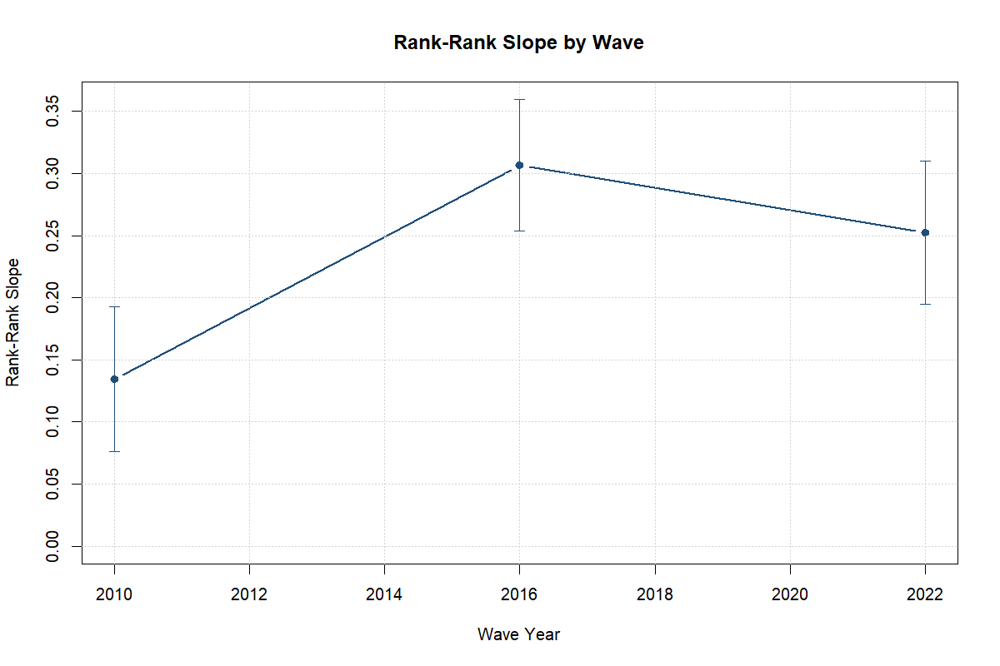
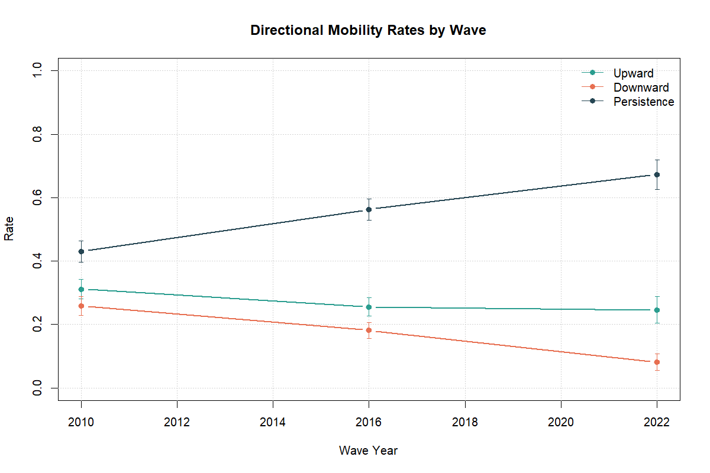

```{r}
read_csv_safe <- function(path) {
  if (!file.exists(path)) {
    stop(sprintf("Required file is missing: %s", path))
  }
  utils::read.csv(path, stringsAsFactors = FALSE)
}

fmt_num <- function(x, digits = 3) {
  sprintf(paste0("%.", digits, "f"), as.numeric(x))
}

fmt_pct <- function(x, digits = 1) {
  sprintf(paste0("%.", digits, "f%%"), 100 * as.numeric(x))
}

fmt_p <- function(x) {
  x <- as.numeric(x)
  if (is.na(x)) {
    return(NA_character_)
  }
  if (x < 0.001) {
    return("<0.001")
  }
  sprintf("%.3f", x)
}

project_file <- function(...) {
  file.path("..", ...)
}

module_a_summary <- read_csv_safe(project_file("outputs", "tables", "module_a_summary_metrics.csv"))
module_b_coef <- read_csv_safe(project_file("outputs", "tables", "module_b_model_coefficients.csv"))
module_b_wave_profiles <- read_csv_safe(project_file("outputs", "tables", "module_b_persistence_wave_profiles.csv"))
module_b_wave_tests <- read_csv_safe(project_file("outputs", "tables", "module_b_wave_difference_tests.csv"))
module_c_sample <- read_csv_safe(project_file("outputs", "tables", "module_c_mechanism_sample.csv"))
module_c_summary <- read_csv_safe(project_file("outputs", "tables", "module_c_mechanism_summary.csv"))
module_c_coef <- read_csv_safe(project_file("outputs", "tables", "module_c_mechanism_coefficients.csv"))
hbs_context <- read_csv_safe(project_file("outputs", "tables", "hbs_household_support_context.csv"))
rank_change_tests <- read_csv_safe(project_file("outputs", "tables", "empirical_rank_rank_change_tests.csv"))

metric_row <- function(metric, wave_year) {
  out <- module_a_summary[
    module_a_summary$subgroup_type == "overall" &
      module_a_summary$subgroup_value == "all" &
      module_a_summary$metric == metric &
      module_a_summary$wave_year == wave_year,
  ]
  out[1, ]
}

metric_est <- function(metric, wave_year) as.numeric(metric_row(metric, wave_year)$estimate)
metric_n <- function(metric, wave_year) as.integer(metric_row(metric, wave_year)$n)

coef_row <- function(model, term) {
  out <- module_b_coef[module_b_coef$model == model & module_b_coef$term == term, ]
  out[1, ]
}

coef_est <- function(model, term) as.numeric(coef_row(model, term)$estimate)

rank_change_value <- function(comparison, column = "estimate") {
  rows <- rank_change_tests[rank_change_tests$comparison == comparison, ]
  rows[[column]][1]
}

module_b_profile_value <- function(specification, wave_year, column = "estimate") {
  rows <- module_b_wave_profiles[
    module_b_wave_profiles$specification == specification &
      module_b_wave_profiles$wave_year == wave_year,
  ]
  rows[[column]][1]
}

module_b_wave_test_value <- function(specification, comparison, column = "estimate") {
  rows <- module_b_wave_tests[
    module_b_wave_tests$specification == specification &
      module_b_wave_tests$comparison == comparison,
  ]
  rows[[column]][1]
}

mech_summary_row <- function(outcome, group = "overall", group_value = "all") {
  out <- module_c_summary[
    module_c_summary$outcome == outcome &
      module_c_summary$group == group &
      module_c_summary$group_value == group_value,
  ]
  out[1, ]
}

mech_est <- function(outcome, group = "overall", group_value = "all") {
  as.numeric(mech_summary_row(outcome, group, group_value)$estimate)
}

mech_coef_row <- function(model, term) {
  out <- module_c_coef[module_c_coef$model == model & module_c_coef$term == term, ]
  out[1, ]
}

mech_coef_est <- function(model, term) as.numeric(mech_coef_row(model, term)$estimate)

sample_n <- function(step_pattern) {
  idx <- grep(step_pattern, module_c_sample$step)
  as.integer(module_c_sample$n[idx[1]])
}

hbs_context_est <- function(metric) {
  as.numeric(hbs_context$national[hbs_context$metric == metric][1])
}
```

## Motivation

- Educational mobility indicates how strongly family background shapes opportunity.
- In Uzbekistan, human-capital strategy and regional inequality make this policy-relevant.
- If parent-child persistence is high, expansion alone may not equalize outcomes.

**Focus:** what the data can credibly show about persistence levels and correlates.

## Research Question and Contribution

- How persistent is educational attainment across generations in Uzbekistan?
- Which household and regional factors are correlated with mobility in pooled data?
- What does LiTS IV suggest about household learning conditions during COVID disruption?

**Contribution:** a reproducible three-wave mobility profile with a bounded, non-causal Module C extension.

## Data

- Main data: LiTS 2010, 2016, and 2022-23 repeated cross-sections.
- Adult analytical sample: ages 25-64, weighted throughout.
- Supplementary context: HBS (not used for headline intergenerational estimates).
- Module C: LiTS IV child module only.

## Mobility Measures

- Harmonized parental schooling: six-category scale, using higher observed parental category.
- Rank-based measure: within-wave weighted rank-rank slope.
- Category-based measures: upward mobility, downward mobility, same-category persistence.

**Interpretation rule:** rank-based results carry more weight because they are less sensitive to category coarseness and sparse 2022 origin cells.

## Main Descriptive Results

:::: {.columns}
::: {.column width="58%"}
- Rank-rank slope: `r fmt_num(metric_est("rank_rank_slope", 2010))` (2010), `r fmt_num(metric_est("rank_rank_slope", 2016))` (2016), `r fmt_num(metric_est("rank_rank_slope", 2022))` (2022-23).
- 2022 category persistence is high (`r fmt_pct(metric_est("persistence_probability", 2022))`), but low-origin 2022 transition cells remain sparse.
- Formal raw tests: 2010->2016 change `r fmt_num(rank_change_value("2010_to_2016"))` (p = `r fmt_p(rank_change_value("2010_to_2016", "p.value"))`); 2016->2022 change `r fmt_num(rank_change_value("2016_to_2022"))` (p = `r fmt_p(rank_change_value("2016_to_2022", "p.value"))`).
- **Main read:** the statistically clearest strengthening is from 2010 to 2016; 2022-23 remains above the 2010 baseline, but the 2016-to-2022 difference is flatter and less precise.
:::
::: {.column width="42%"}
{width=100%}
:::
::::

## Pooled Correlates

- Conditional 2010->2016 slope increase stays positive across minimal, demographic, and extended specs: `r fmt_num(module_b_wave_test_value("minimal", "2010_to_2016"))`, `r fmt_num(module_b_wave_test_value("demographic", "2010_to_2016"))`, `r fmt_num(module_b_wave_test_value("extended", "2010_to_2016"))`.
- Conditional 2016->2022 difference is negative but imprecise across the same specs: `r fmt_num(module_b_wave_test_value("minimal", "2016_to_2022"))`, `r fmt_num(module_b_wave_test_value("demographic", "2016_to_2022"))`, `r fmt_num(module_b_wave_test_value("extended", "2016_to_2022"))`.
- Parent education score remains the strongest correlate of attainment: `r fmt_num(coef_est("eq3_attainment_score", "parent_ed_score"))`.
- Female coefficient in attainment model is negative: `r fmt_num(coef_est("eq3_attainment_score", "female"))`.

**Main read:** strongest evidence is on high persistence levels, a clear mid-period strengthening, and stable parental-background correlates, not on a further post-2016 worsening.

## Module C as Bounded Extension

- LiTS IV Uzbekistan respondents: `r sample_n("^Uzbekistan LiTS IV respondents$")`; final mechanism sample: `r sample_n("^Mechanism sample with non-missing parental schooling$")`.
- Education stopped during COVID: `r fmt_pct(mech_est("education_stopped_covid"))`.
- Mother reported as support channel: `r fmt_pct(mech_est("support_mother"))`.
- Stoppage coefficient for low parental education: `r fmt_num(mech_coef_est("m3_education_stopped_covid", "parent_low_edu"))`.

**Main read:** suggestive evidence of household vulnerability, not a causal mechanism estimate.

## Key Caveats

- Repeated cross-sections, not a family panel.
- The statistically clearest strengthening is from 2010 to 2016; 2022-23 remains above the 2010 baseline, but the 2016-to-2022 difference is flatter and less precise.
- Rank-based results are more stable than category detail because sparse 2022 origin cells still limit some category comparisons.
- Inference uses region-clustered standard errors without an extra small-sample correction.
- Module C is secondary and based on a limited subsample.

## HBS Household Support Context

- HBS is supplementary context, not the main mobility engine.
- `r fmt_pct(hbs_context_est("has_enrolled_member"))` of pooled HBS households had an enrolled member.
- `r fmt_pct(hbs_context_est("education_spending_positive"))` reported positive education spending and `r fmt_pct(hbs_context_est("has_tutoring"))` reported tutoring.
- `r fmt_pct(hbs_context_est("has_remittance_hh"))` received remittances, while `r fmt_pct(hbs_context_est("internet_access_hh"))` had internet access in the 2021-2024 internet module.
- A separate HBS descriptive note extends this context by year, urban-rural setting, region, and descriptive expansion grouping.

## Policy Implications

1. Prioritize transition-stage equalization (lower-to-upper-secondary and upper-secondary-to-post-secondary).
2. Target household learning bottlenecks directly (devices, connectivity quality, caregiver support capacity).
3. Build disruption-readiness protocols so household disadvantage is less likely to translate into education stoppage.
4. Treat household support burdens, especially maternal burdens, as part of education policy design.

## Conclusion

- Intergenerational educational persistence in Uzbekistan is substantial.
- The statistically clearest strengthening is from 2010 to 2016; 2022-23 remains above the 2010 baseline, but the 2016-to-2022 difference is flatter and less precise.
- Parental education remains the clearest pooled correlate of attainment.
- Module C adds bounded descriptive evidence on household vulnerability during disruption.

## Backup / Appendix

:::: {.columns}
::: {.column width="58%"}
- Upward mobility rates: `r fmt_pct(metric_est("upward_mobility_rate", 2010))`, `r fmt_pct(metric_est("upward_mobility_rate", 2016))`, `r fmt_pct(metric_est("upward_mobility_rate", 2022))`.
- Downward mobility rates: `r fmt_pct(metric_est("downward_mobility_rate", 2010))`, `r fmt_pct(metric_est("downward_mobility_rate", 2016))`, `r fmt_pct(metric_est("downward_mobility_rate", 2022))`.
- 2022 rank and category measures use the same harmonized denominator of `r metric_n("rank_rank_slope", 2022)`, but category detail is still less stable in sparse origin cells.
:::
::: {.column width="42%"}
{width=100%}
:::
::::
